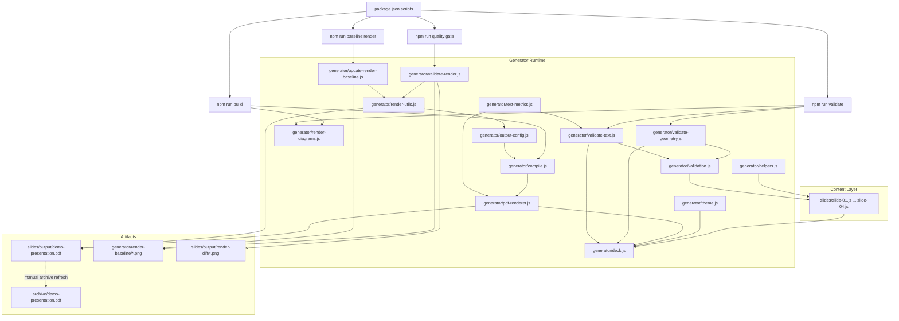

# Architecture

This document explains how the presentation template is assembled, rendered, validated, and archived.

## Overview

The repository is organized around one core idea: slide content is authored once in `slides/`, and the shared generator runtime in `generator/` drives build and validation workflows around that content.

`generator/deck.js` is the central composition point. It imports the slide modules, applies shared theme and deck metadata, and exposes a single `populatePresentation(...)` function that both build and validation paths reuse.

## System Graph

## Main Concepts

### Slide Modules

Each slide file in `slides/` exports a `createSlide(pres, theme, options)` function plus slide metadata. The slide code does not know whether it is participating in a build or a validation run; it receives a presentation-like object and writes shapes and text into it.

### Shared Presentation Contract

The repository uses a shared presentation contract so the same slide modules can serve multiple purposes:

- `generator/deck.js` uses `PptxGenJS` to build an in-memory presentation model for geometry and text validation.
- `generator/pdf-renderer.js` defines a custom `PdfPresentation`/`PdfSlide` implementation with the same slide-writing surface needed by the current deck.
- `populatePresentation(...)` in [`generator/deck.js`](</Users/juhovepsalainen/Projects/presentation-template/generator/deck.js>) is the adapter point that lets both implementations reuse the same slide files.

This is why `pptxgenjs` still exists as a dependency even though the production output is PDF-only.

### Theme And Helper Layer

[`generator/theme.js`](</Users/juhovepsalainen/Projects/presentation-template/generator/theme.js>) defines the shared color palette, fonts, and deck metadata. [`generator/helpers.js`](</Users/juhovepsalainen/Projects/presentation-template/generator/helpers.js>) provides reusable slide-level primitives such as section titles and page badges.

Slides depend on those files so style decisions stay centralized rather than drifting slide by slide.

## Build Flow

The build path is intentionally small:

1. `npm run build` first runs [`generator/render-diagrams.js`](</Users/juhovepsalainen/Projects/presentation-template/generator/render-diagrams.js>) to regenerate any Graphviz-authored diagram assets from `slides/assets/diagrams/*.dot`.
2. `npm run build` then runs [`generator/compile.js`](</Users/juhovepsalainen/Projects/presentation-template/generator/compile.js>).
3. `compile.js` asks [`generator/pdf-renderer.js`](</Users/juhovepsalainen/Projects/presentation-template/generator/pdf-renderer.js>) for a PDF presentation.
4. `pdf-renderer.js` calls `populatePresentation(...)` from [`generator/deck.js`](</Users/juhovepsalainen/Projects/presentation-template/generator/deck.js>) to let the slide modules populate a `PdfPresentation`.
5. The renderer writes the final PDF to the path from [`generator/output-config.js`](</Users/juhovepsalainen/Projects/presentation-template/generator/output-config.js>), currently [`slides/output/demo-presentation.pdf`](</Users/juhovepsalainen/Projects/presentation-template/slides/output/demo-presentation.pdf>).

## Validation Flow

There are three validation layers, each checking a different kind of failure.

Before those slide-level validators run, `npm run validate` also executes [`generator/render-diagrams.js`](</Users/juhovepsalainen/Projects/presentation-template/generator/render-diagrams.js>) to enforce that any PNG diagram assets under `slides/assets/diagrams/` have matching Graphviz `.dot` sources.

### Geometry Validation

[`generator/validate-geometry.js`](</Users/juhovepsalainen/Projects/presentation-template/generator/validate-geometry.js>) builds an in-memory presentation with `createPresentation(...)` and asks [`generator/validation.js`](</Users/juhovepsalainen/Projects/presentation-template/generator/validation.js>) to detect:

- groups extending beyond slide bounds
- overlapping layout groups

### Text-Fit Validation

[`generator/validate-text.js`](</Users/juhovepsalainen/Projects/presentation-template/generator/validate-text.js>) uses the same reports from `generator/validation.js`, but now covers:

- text-fit checks using PDF-backed text measurement from [`generator/text-metrics.js`](</Users/juhovepsalainen/Projects/presentation-template/generator/text-metrics.js>)
- text contrast checks against slide or containing panel backgrounds
- image aspect-ratio checks for placed assets
- text padding checks inside panel-like groups

### Render Validation

[`generator/validate-render.js`](</Users/juhovepsalainen/Projects/presentation-template/generator/validate-render.js>) validates the actual rendered PDF output:

1. Build the PDF.
2. Rasterize the PDF pages with ImageMagick through [`generator/render-utils.js`](</Users/juhovepsalainen/Projects/presentation-template/generator/render-utils.js>).
3. Compare the rendered pages to the approved baseline in [`generator/render-baseline`](</Users/juhovepsalainen/Projects/presentation-template/generator/render-baseline>).
4. Write mismatch diffs under `slides/output/render-diff/` when pages drift.

`npm run quality:gate` runs the geometry/text validators first and then this render-validation path.

## Baseline And Archive

The repository keeps two kinds of long-lived outputs for different purposes:

- [`generator/render-baseline`](</Users/juhovepsalainen/Projects/presentation-template/generator/render-baseline>) is the approval target for visual regression testing.
- [`archive/demo-presentation.pdf`](</Users/juhovepsalainen/Projects/presentation-template/archive/demo-presentation.pdf>) is the checked-in presentation snapshot for linking and archival.

They serve different roles. Refreshing the render baseline is part of intentional visual changes. Refreshing the archive copy is a separate publishing decision.

## Extension Points

If you change the deck, these are the normal entry points:

- Add or reorder slides in [`generator/deck.js`](</Users/juhovepsalainen/Projects/presentation-template/generator/deck.js>).
- Adjust palette or typography in [`generator/theme.js`](</Users/juhovepsalainen/Projects/presentation-template/generator/theme.js>).
- Add reusable drawing helpers in [`generator/helpers.js`](</Users/juhovepsalainen/Projects/presentation-template/generator/helpers.js>).
- Expand validation behavior in [`generator/validation.js`](</Users/juhovepsalainen/Projects/presentation-template/generator/validation.js>) or the dedicated validator entry points.
- Change output file naming in [`generator/output-config.js`](</Users/juhovepsalainen/Projects/presentation-template/generator/output-config.js>).

## Future Option: Extract A Runtime Package

If this repository becomes the first of several decks using the same runtime, it would make sense to extract part of `generator/` into a small package. The important distinction is that the current directory contains both reusable runtime code and repo-specific deck wiring.

### Good Candidates For Extraction

- [`generator/pdf-renderer.js`](</Users/juhovepsalainen/Projects/presentation-template/generator/pdf-renderer.js>) for the PDF presentation implementation
- [`generator/validation.js`](</Users/juhovepsalainen/Projects/presentation-template/generator/validation.js>) for geometry and text-fit validation
- [`generator/render-utils.js`](</Users/juhovepsalainen/Projects/presentation-template/generator/render-utils.js>) for rasterization and diff support
- small shared abstractions around build and validation entry points

### Keep Local To The Deck Repo

- [`generator/deck.js`](</Users/juhovepsalainen/Projects/presentation-template/generator/deck.js>) because it imports local slides and defines deck order
- [`generator/theme.js`](</Users/juhovepsalainen/Projects/presentation-template/generator/theme.js>) because it carries this deck's palette, fonts, and metadata
- [`generator/helpers.js`](</Users/juhovepsalainen/Projects/presentation-template/generator/helpers.js>) because it encodes the current visual language
- [`generator/output-config.js`](</Users/juhovepsalainen/Projects/presentation-template/generator/output-config.js>) because it knows local artifact paths and naming

### Recommended Boundary

If extraction happens, the package should be the runtime layer, not the entire `generator/` directory. A consuming deck repo should still own:

- slide modules
- deck composition and ordering
- theme and presentation metadata
- output file naming
- archive policy

### When It Starts Making Sense

Extraction becomes worthwhile if at least one of these is true:

- a second deck repository needs the same renderer and validators
- the runtime needs to be tested independently from any one deck
- a stable slide API is needed across multiple decks

If this stays a single-deck repository, keeping the code local is simpler and avoids package-versioning overhead.

### Recommended Path

If this is pursued later, start with a local workspace package before publishing to npm. That would let the boundary harden before committing to a public API surface.

An eventual package should likely export things like:

- `createPdfPresentation`
- `createSlideCanvas`
- `validateGeometry`
- `validateTextFit`
- render-baseline utilities

### Current Constraints Blocking A Clean Extraction

- the PDF renderer currently bakes in macOS font paths
- the rendering contract is intentionally narrow and only supports the operations this deck uses
- the build and validation scripts are still organized around this repository's filesystem layout

## Constraints

- The production artifact is PDF, not PPTX.
- The slide modules must stay compatible with the limited drawing surface implemented by `PdfPresentation`.
- Diagram graphics are expected to come from Graphviz source files under `slides/assets/diagrams/`.
- Render validation depends on `magick` being available locally.
- The archival PDF is not updated automatically by the build.
