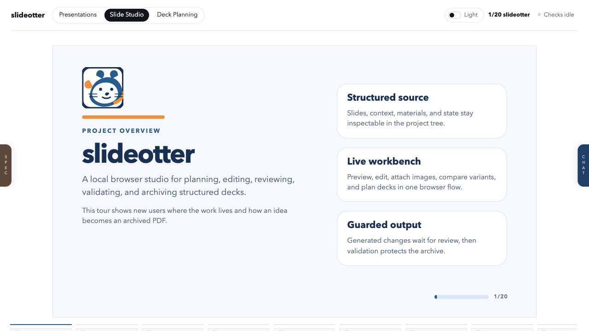

# slideotter

slideotter is a local, DOM-first presentation workbench for structured decks. It keeps slide content, previews, workflow actions, variant review, and validation in one browser loop so deck changes can move from intent to checked output without losing the source.

It is not a PowerPoint replacement and not a broad WYSIWYG editor. The project focuses on pragmatic authoring support for decks that are already structured enough to render, compare, and validate reliably.

## What It Does

- Edits supported slides from compact JSON slide specs.
- Renders the active deck through one shared DOM runtime for studio previews, thumbnails, comparison panes, preview PNGs, and PDF export.
- Supports direct text edits from the rendered slide preview for structured slides.
- Keeps presentation-scoped image materials uploadable and attachable to structured slides.
- Generates slide and deck-planning candidates through local rules or an optional LLM provider.
- Keeps generated candidates previewable, comparable, and safely applicable before they overwrite the working slide.
- Shows visual and structured comparisons for slide candidates and larger deck plans.
- Runs geometry, text, media, deck-plan, and render-baseline validation through the same quality gate used by the CLI.

## Current Demo

The repository includes a twenty-slide demo deck that introduces the project to new users:

- `presentations/slideotter/slides/slide-01.json`: project overview
- `presentations/slideotter/slides/slide-02.json`: tour map
- `presentations/slideotter/slides/slide-03.json`: why decks get messy
- `presentations/slideotter/slides/slide-04.json`: basic authoring loop
- `presentations/slideotter/slides/slide-05.json`: presentation selection
- `presentations/slideotter/slides/slide-06.json`: deck brief
- `presentations/slideotter/slides/slide-07.json`: readable JSON slides
- `presentations/slideotter/slides/slide-08.json`: preview-first editing
- `presentations/slideotter/slides/slide-09.json`: image materials
- `presentations/slideotter/slides/slide-10.json`: shared DOM renderer
- `presentations/slideotter/slides/slide-11.json`: generated options
- `presentations/slideotter/slides/slide-12.json`: comparison workflow
- `presentations/slideotter/slides/slide-13.json`: deck-level planning
- `presentations/slideotter/slides/slide-14.json`: bounded assistant tasks
- `presentations/slideotter/slides/slide-15.json`: write boundaries
- `presentations/slideotter/slides/slide-16.json`: validation before sharing
- `presentations/slideotter/slides/slide-17.json`: archive routine
- `presentations/slideotter/slides/slide-18.json`: codebase orientation
- `presentations/slideotter/slides/slide-19.json`: next improvements
- `presentations/slideotter/slides/slide-20.json`: daily habit

Current local PDF output is written to `slides/output/<presentation-id>.pdf`, so the included `slideotter` deck builds to `slides/output/slideotter.pdf`. Publishing copies the active deck to `archive/<presentation-id>.pdf`.

## Browser Studio

The local studio lives under `studio/` and runs as a small Node server with a static browser client.

The UI currently includes:

- a compact sticky navigation with the project name first
- visual presentation selection with create, duplicate, and delete workflows
- active slide preview and thumbnail navigation
- collapsible selected-slide context
- direct slide-text editing from the DOM preview
- image material upload, attach, and detach controls for the selected slide
- workflow chat with optional selected-text context from the current slide
- slide candidate generation, review, visual comparison, and apply controls
- deck planning with manual system-slide insertion and removal, compact plan summaries, palette controls, and apply previews
- masthead checks panel with compact settings and discoverable rule severity overrides

The same DOM renderer is also exposed as a standalone deck preview at `/deck-preview` while the studio server is running.

## Repository Map

- `presentations/`: presentation folders containing slide specs, image materials, and per-presentation state
- `slides/output/`: generated local PDF output
- `studio/client/`: browser UI and shared DOM slide renderer
- `studio/server/`: local server, workflow actions, export, validation, write boundary, and LLM integration
- `studio/state/`: global studio registry plus repo-local assistant sessions and related state
- `studio/baseline/<presentation-id>/`: approved render-baseline images for visual regression checks
- `scripts/`: CLI wrappers for build, validation, diagram rendering, and baseline refresh
- `skills/`: presentation-focused Codex workflow guidance
- `docs/adr/`: durable studio decisions

## Documentation

- [DEVELOPMENT.md](DEVELOPMENT.md): local setup, commands, validation, LLM provider setup, and workflow rules
- [ARCHITECTURE.md](ARCHITECTURE.md): current rendering, build, validation, and artifact architecture
- [TECHNICAL.md](TECHNICAL.md): lower-level technical notes and project layout
- [ROADMAP.md](ROADMAP.md): current architecture direction and next maintenance focus
- [STUDIO_STATUS.md](STUDIO_STATUS.md): live implementation snapshot
